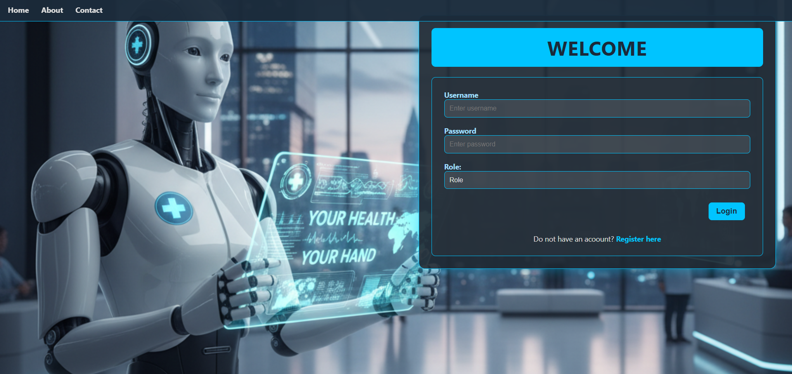
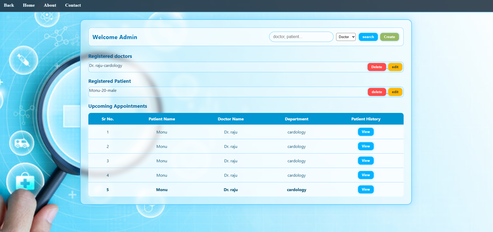
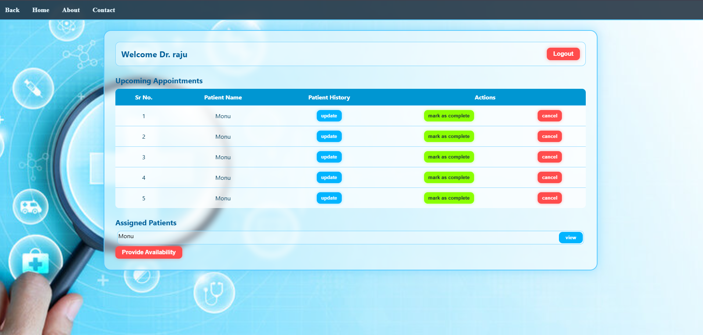
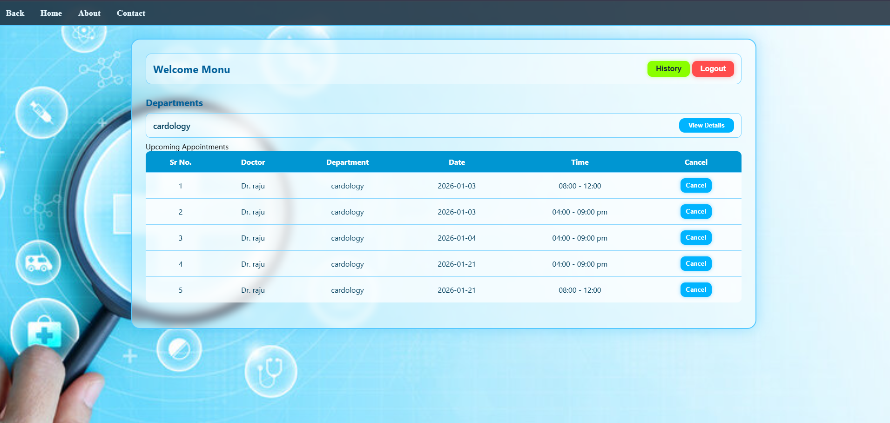
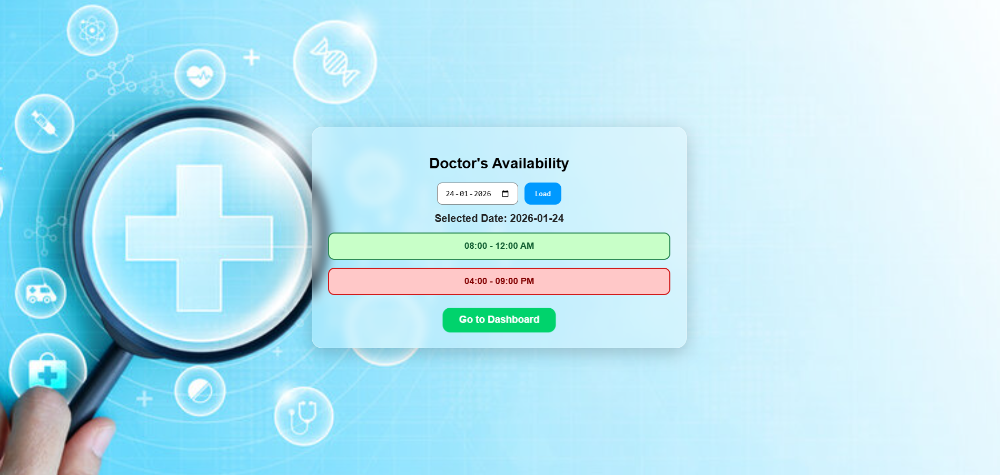

# 🏥 Hospital Management System

The **Hospital Management System** is a web-based application designed to digitize and streamline the administrative and clinical operations of a healthcare facility.  
It replaces manual, paper-based records with a **centralized digital database**, improving efficiency, accuracy, and accessibility of hospital data.

---

## 🎯 Objective

The primary objective of this system is to provide an efficient platform for managing:
- Doctors
- Patients
- Appointments
- Medical records

while ensuring **role-based access control** for secure and organized operations.

---

## 👥 User Roles & Permissions

The application supports **three distinct user roles**, each with specific responsibilities:

### 🔐 Admin
- Manage doctors and patients
- View and monitor all appointment logs
- Oversee overall system operations

### 🩺 Doctor
- Manage personal availability
- View assigned patients
- Update patient medical history

### 🧑‍⚕️ Patient
- Register and log in to the system
- View doctors by department
- Book appointments online

---

## 🛠️ Technology Stack

- **Backend:** Python, Flask  
- **Frontend:** HTML, CSS  
- **Database:** SQLite  
- **Architecture:** MVC-based structure  

---

## 🚀 Features

- Role-based authentication and authorization
- Doctor availability management
- Department-wise doctor listing
- Online appointment booking
- Secure and centralized data storage

---
## 📸 Screenshots








## ▶️ How to Run the Project

```bash
python app.py


